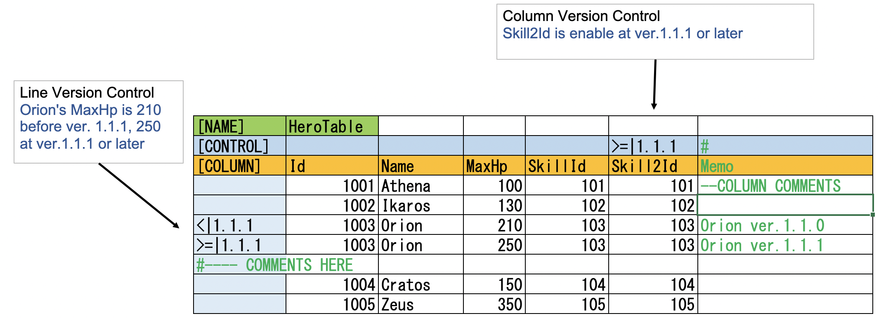

# shtxt

Shtxt is flexible, extensible, configurable spread-sheet-to-text converter.

### Source spread sheet:



### Output text:

```
Id	Name	MaxHp	SkillId
1001	Athena	100	101
1002	Ikaros	130	102
1003	Orion	210	103
1004	Cratos	150	104
1005	Zeus	350	105
```

### Usage

```
Usage:
  shtxt [options] [<input-files>...]

Arguments:
  <input-files>

Options:
  -p, --input-pattern <input-pattern>          Input file name pattern
  -l, --version-list <version-list>            Version list file
  -r, --current-version <current-version>      Current version
  -o, --output-dir <output-dir>                Output directory
  -n, --newline <newline>                      Newline code(cr,lf,crlf)
  -f, --text-format <text-format>              Output format(csv,tsv)
  -c, --config-file <config-file>              Config file
  --version                                    Show version information
  -?, -h, --help                               Show help and usage information
```


## Features

- Load spread sheet files, detect control commands, interpret and process, then convert to text file
- Can enable/disable lines and columns by versioning system
- Most of parameters are configurable by command line arguments and config file
- Converts multi files on multi threads
- Achieves software flexibility with data flow design

## Notes

- Currently supports XSSFWorkbook (aka .xlsx file)


---
---

Shtxtは、柔軟性、拡張性、設定性に優れた、スプレッドシートからテキストへの変換ツールです。

```
使い方
  shtxt [オプション] [<input-files>...]...

引数
  <input-files>（入力ファイル

オプション
  -p, --input-pattern <input-pattern>          入力ファイル名のパターン
  -l, --version-list <version-list>            バージョンリストファイル
  -r, --current-version <current-version>      現在のバージョン
  -o, --output-dir <output-dir>                出力ディレクトリ
  -n, --newline <newline>                      改行コード(cr,lf,crlf)
  -f, --text-format <text-format>              出力フォーマット(csv,tsv)
  -c, --config-file <config-file>              設定ファイル
  --version                                    バージョン情報の表示
  -?, -h, --help ヘルプと使用法の情報を表示します。
```


## 機能

- 表計算ソフトのファイルを読み込み、制御コマンドを検出して解釈・処理し、テキストファイルに変換します。
- バージョニングシステムにより、行や列の有効化/無効化が可能
- ほとんどのパラメータは、コマンドライン引数や設定ファイルで設定できます。
- 複数のファイルを複数のスレッドで変換
- データフロー設計によりソフトウェアの柔軟性を実現

## 注意事項

- XSSFWorkbook (別名.xlsxファイル)をサポートしています。

